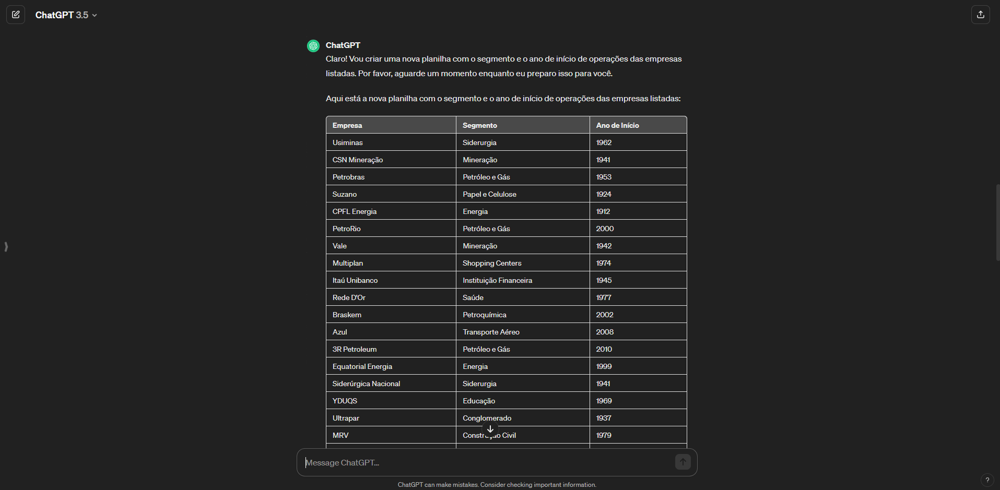

# Análise exploratória de dados no Google Sheets

Acesso ao dados: [Dados de Ações](https://docs.google.com/spreadsheets/d/1fuSo3nHOMpC2QwMXV0gNh1C5DwOs1NuGV7RoCRoBIro/edit?usp=sharing)

## Entendendo os dados
- Neste projeto, relizou-se uma análise minuciosa da base de dados da bolsa de valores, 
utilizando o Google Sheets e explorando uma variedade de ferramentas, como VLOOKUP, SUMIF, 
entre outras fórmulas, com o objetivo de extrair insights valiosos.
    - Base de dados referente a *Bolsa de Valores* 
 
 
 

### Folha Principal
Para essa análise exploratória foram consideradas apenas algumas coluna, conforme descriminado abaixo:
- Coluna A = Ativo *(Ticker)*
- Coluna B = Data *(data de movimentação)*
- Coluna C = Último (R$) *(Valor final da ação no dia da movimentação)*
- Coluna D = Var. Dia (%) *(Variação do dia em taxa percentual)*

### Folha Total_de_acoes
Para essa análise exploratória foram consideradas as colunas conforme descriminado abaixo:
- Coluna A = Código *(Ticker)*
- Coluna B = Qtde. Teórica *(Quantidade teórica de ações)*

### Folha Ticker
Para essa análise exploratória foram consideradas as colunas conforme descriminado abaixo:
- Coluna A = Ticker *(Código da empresa)
- Coluna B = Nome *(Empresa)*

### Folha Chat_gpt
Para essa análise exploratória foram consideradas as colunas conforme descriminado abaixo:
- Coluna A = Nome da Empresa
- Coluna B = Segmento
- Coluna C = Idade (anos)
- Coluna D = Inicio de Operação

## Manipulação do dados
### Criação de novas colunas na **Folha Principal**
1. Na primeira etapa criou-se uma coluna na folha principal com os valores de quantidade de ações por empresa para posteriormente ser possível calcular em **R$** o quanto foi a **Variação do dia**
- Coluna L = Qtde de Ações
    - Com a função *procv()* foi possível buscar na **folha Total_de_acoes** a **Qtde. Teórica** utilizando como *critério* a coluna **Ativo** da **folha Principal**
     
        =PROCV(A3;Total_de_acoes!A:B;2;0) *replicar para outras celulas*
     
 
 
 

2. Na segunda etapa criou 4 colunas para visualizar os resultados da variação diária, composto por variação em decimal, valor inicial (R$), variação total (R$) e resultado
- Coluna M = Variação %
    - Utilizando uma operação matemática simples
     
    **Var. Dia (%)** por *100*
     

- Coluna N = Valor inicial (R$)
    - Utilizando uma operação matemática simples
      
    **Último (R$)** por (1 + **Variação %** )
     

- Coluna O = Variação $
    - Utilizando uma operação matemática simples
     
    (**Último (R$)** - **Valor inicial (R$)**)/**Qtde de Ações**
     

- Coluna P = Resultado
    - Para identificar mais facilmente as ações que subiram, estabilizaram e desceram foi criada a coluna P com auxilia da função se()
     
    SE(Coluna O>0;"Subiu";SE(Coluna O< 0;"Desceu";"Estável")) *replicar para outras celulas*
     
 
 
 

3. Na terceira etapa, afim de explorar ainda mais a base de dados, também foram criadas colunas referentes as *Resultados da variações semanal, mensal, anual e de 12 meses*, a lógica de construções dessas colunas segue semelhtante as operações realizadas no item 2. para criar o *Resultado diário*.
    - Repitir os passos no item 2. logo acima
 
 
 

4. Na quarta etapa foi criada uma nova folha *Chat_gpt* para afim de coletar atráves da IA Generatira informações das empresas do mercado de ações.
- A partir do nome da empresas foi solicitado ao ChatGPT o ano de início de operações
 
 
 

- O retorno da ferramenta ChatGPT foi obtida conforme a necessidade
 
 
 

5. Na quinta etapa foram criadas mais 4 colunas na folha *Principal* com informações gerais das empresas, sendo nome da empresa, segmento, idade em anos e faixa de idade
- Coluna AG = Nome da Empresa
    - Com a função *procv()* foi possível buscar na **folha Ticker** a coluna **Nome** utilizando como *critério* a coluna **Ativo** da **folha Principal**
     
        =PROCV(A22;Ticker!A:B;2;0) *replicar para outras celulas*
     

- Coluna AH = Segmento 
    - Com a função *procv()* foi possível buscar na **folha Chat_gpt** a coluna **Segmento** utilizando como *critério* a coluna **Nome da Empresa** da **folha Principal**
     
        =PROCV(AG3;Chat_gpt!$A$1:$C$82;2;0) *replicar para outras celulas*
     

- Coluna AI = Idade 
    - Com a função *procv()* foi possível buscar na **folha Chat_gpt** a coluna **Idade (anos)** utilizando como *critério* a coluna **Nome da Empresa** da **folha Principal**
     
        =PROCV(AG3;Chat_gpt!$A$1:$C$82;3;0) *replicar para outras celulas*
     

- Coluna AJ = Cat_idade
    - Criação de faixa de idade, sendo menor que 50 anos, entre 50 e 100 anos e maior que 100 anos
     
        =SE(AI3>100;"Mais de 100 anos";SE(AI3<50;"Menos de 50 anos";"Entre 50 e 100 anos"))  *replicar para outras celulas*
     
 
 
 

## Principais análises realizadas
1. Conversão dos valores decimais para porcentagens.
2. Cálculo do valor inicial de cada ação.
3. Determinação da quantidade de ações em um único dia para cada ativo.
4. Cálculo das variações em reais para cada ativo em um único dia.
5. Criação de categorias, incluindo nome da empresa, segmento e idade para cada ativo.
*Observação: A idade em anos foi calculada levando em consideração o ano atual (2024) e o ano de 
fundação de cada empresa, quando disponível. Quando o ano de fundação não estava disponível, 
utilizou-se uma estimativa aproximada.*