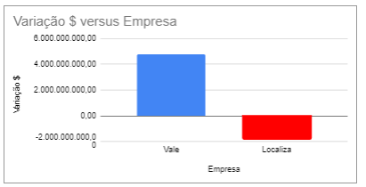
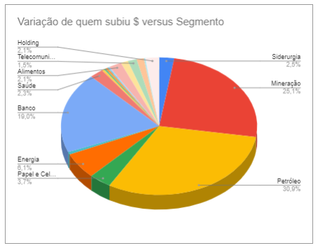
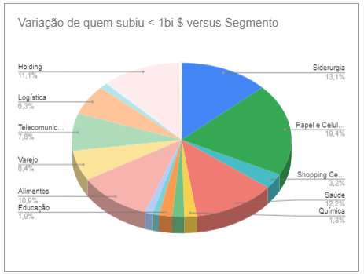
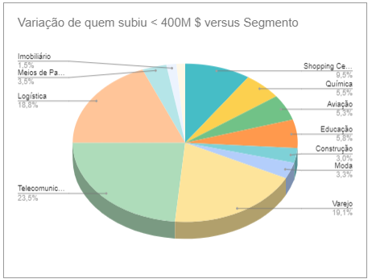
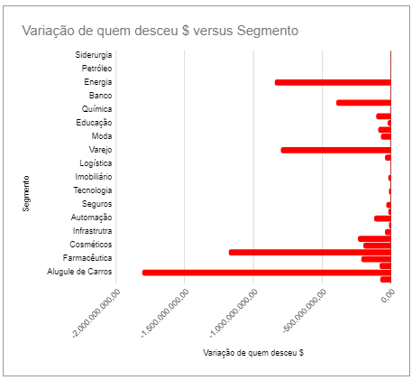
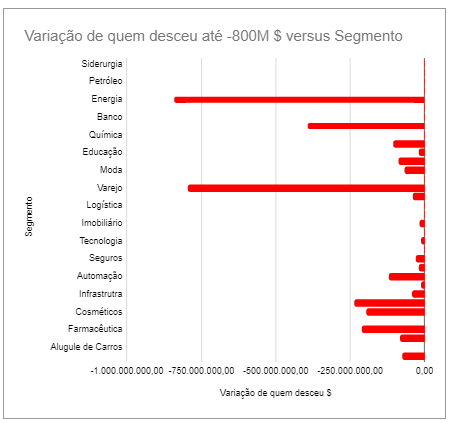
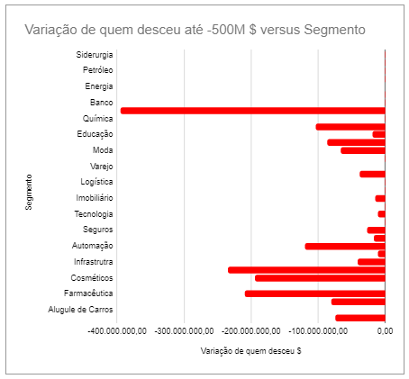
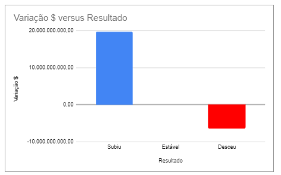
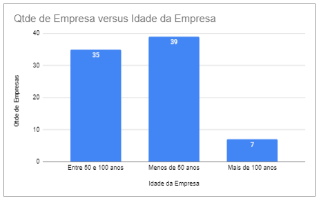
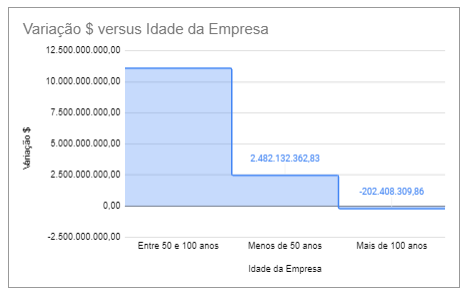

# Criação de Gráficos e Análises com Google Sheets
Link da planilha no Google Sheets: [Planilha de Análise Financeira](https://docs.google.com/spreadsheets/d/1fuSo3nHOMpC2QwMXV0gNh1C5DwOs1NuGV7RoCRoBIro/edit?usp=sharing)

## Análises para o Estudo
### Análise Descritiva
    Aplicação de análise básica, como valor máximo, mínimo e média, utilizando funções como MAIOR(), MENOR(), MÉDIA() e MÉDIASE().

### Análise Qualitativa
    Aplicação de agrupamentos de categorias utilizando funções como ÚNICO() e aplicando funções de estatísticas como CONT.SE() e CONT.SES(), e funções matemáticas como MÉDIASE(), SOMASE() e SOMSSSES().

### Visualização
    Aplicação de gráficos do tipo pizza, barras, colunas e áreas para melhor compreensão dos dados.

## Perguntas de Negócio
### Análise Descritiva
- Em relação à variação $ do dia, qual é a maior, a menor e a média variação?
    - **Resposta:** A média diária de variação geral, considerando todos os valores, foi de 165M.

- Em relação à Média, quais são os valores das médias referentes às variações que subiram (positivas) e que desceram (negativas)?
    - **Resposta:** É crucial agrupar os dados semelhantes, ou seja, valores positivos com positivos e valores negativos com negativos. Portanto, as médias calculadas foram 448M e -181M, respectivamente.

### Análise Qualitativa
- Quais são os agentes que se destacaram tanto com a maior variação quanto com a menor variação?
    - **Resposta:** Ao reunir as informações por segmentos, é possível identificar a soma geral por segmento, retornando os grupos com saldo positivo e negativo. Também é possível identificar apenas a soma dos agentes que possuíram variação positiva, e o contrário também vale, sendo assim, reunir todos os agentes que possuíram variações negativas.

- Qual o balanço do dia em relação aos agentes que tiveram suas variações que subiram e que desceram?
    - **Resposta:** O resultado das ações que subiram foi 19 bi, e o resultado das ações que desceram foi -6 bi. Sendo assim, o saldo final é positivo em valor de mercado das ações.

- Qual o impacto da idade da empresa, e qual faixa representa maior sensibilidade?
    - **Resposta:** Ao agrupar empresas de acordo com o tempo de mercado, é possível obter insights mais profundos. Para este estudo, pode-se identificar que a menor quantidade de empresas está na faixa com idade superior a 100 anos, contendo apenas 7 empresas, o que influencia na variação total. Analisar a quantidade de empresas proporciona uma visão mais completa além do valor total da variação diária.

## Visualização
- Gráfico de colunas para análise descritiva: Variação versus Empresa (maior e menor variação no dia)

 
 
 

- Gráficos de pizza para variações positivas: Variação versus Segmento
    - Variação de quem subiu $ versus Segmento

 
 
 

- Exclusão de pontos fora da curva (outliers): Variação de quem subiu < 1 bi $ versus Segmento

 
 
 

- Exclusão de pontos fora da curva (outliers): Variação de quem subiu < 400M $ versus Segmento

 
 
 

- Gráfico de barras para variações negativas: Variação versus Segmento
    - Variação de quem desceu $ versus Segmento

 
 
 

- Exclusão de pontos fora da curva (outliers): Variação de quem desceu até -800M $ versus Segmento

 
 
 

- Exclusão de pontos fora da curva (outliers): Variação de quem desceu até -500M $ versus Segmento

 
 
 

- Gráfico de colunas para comparação de variações que subiram, estabilizadas e desceram

 
 
 

- Gráfico de áreas para comparação de variações versus faixa de Idade da Empresa

 
 
 

- Gráfico de colunas para comparação de Qtde de Empresa versus a faixa de Idade da Empresa

 
 
 
