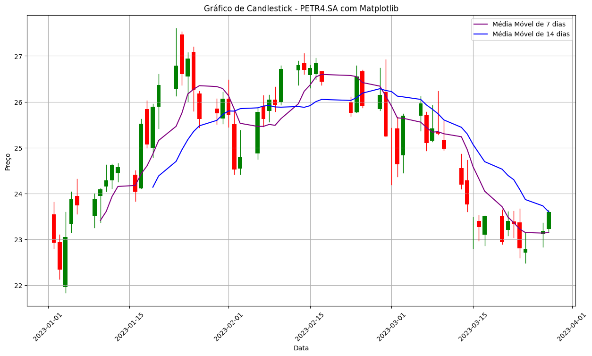
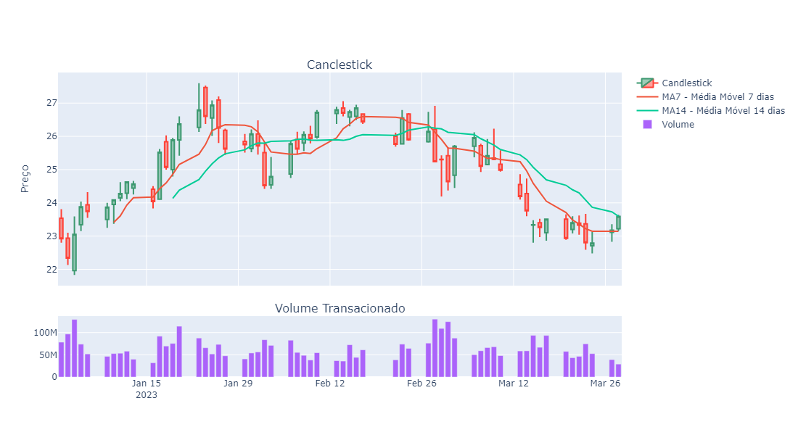

#  Análises Avançadas de Ações e Gráficos de Velas com Python

## Manipulação de dados e criação de gráficos com Python
Acesso ao código: [Gráficos Candlestick](https://colab.research.google.com/drive/13fKAsBUzK0Hz_SS7dn8qHsEDgVjJ2T_M?usp=sharing)

## Ambiente de desenvolvimento
- Google Colab

## Importação do dataset
#### Utilizando a API: Yahoo Finance
    yf.download('PETR4.SA', start='2023-01-01', end='2023-12-31')

## Importação da bibliotecas
- Biblioteca Manipulação:
    - import pandas as pd

- Biblioteca Visualização:
    - import matplotlib.pyplot as plt
    - import matplotlib.dates as mdates
    - import plotly.graph_objects as go
    - from plotly.subplots import make_subplots

- Pacote Gráficos financeiros (Biblioteca Matplotlib):
    - import mplfinance as mpf

- Biblioteca para baixar dados financeiros
    - import yfinance as yf
    
## Crição de dataframe
- dados, 248 rows × 6 columns
- nome colunas: "Open", "High", "Low", "Close",	"Adj Close", "Volume"
- index: Date

## Manipulação de dados:
#### Renomear as colunas:
    dados.columns = ['Abertura','Maximo','Minimo','Fechamento','Fech_Ajust','Volume']

#### Renomear o index:
    dados = dados.rename_axis('Data')

## Entendendo o gráfico de velas (candlestick)
- Candlestick de alta: verde, possuiu um fechamento maior que o valor de abertura 
- Candlestick baixa; vermelho, possuiu um fechamento menor que o valor de abertura

## Visualização do gráfico com Pandas
### Matplotlib
#### Variável "Fechamento"
    dados['Fechamento'].plot(figsize=(10,5))
    plt.title('Variação do preço por data', fontsize=16)
    plt.legend(['Fechamento'])

 

 

## Dataframe para análise
#### Criação de dataframe 'df' com 60 registros do dataframe 'dados'
 
    df = dados.head(60).copy()

#### Criação de uma nova cpluna "Data" a partir do index
    
    df['Data'] = df.index

#### Tranformação a coluna 'Data' em valor númerico
    df['Data']=df['Data'].apply(mdates.date2num)

## Visualização do Gráfico Candlestick
#### Matplotlib
    fig, ax = plt.subplots(figsize=(15,8))
    width = 0.7

    for i in range(len(df)):
        if df['Fechamento'].iloc[i] > df['Abertura'].iloc[i]:
            color='green'
        else:
            color='red'

        ax.plot([df['Data'].iloc[i], df['Data'].iloc[i]],
                [df['Minimo'].iloc[i], df['Maximo'].iloc[i]],
                color=color,
                linewidth=1)

        ax.add_patch(plt.Rectangle((df['Data'].iloc[i] - width/2,
                                    min(df['Abertura'].iloc[i],
                                    df['Fechamento'].iloc[i])),
                                    width,
                                    abs(df['Fechamento'].iloc[i] - df['Abertura'].iloc[i]),
                                    facecolor=color))

    df['MA7'] = df['Fechamento'].rolling(window=7).mean()
    df['MA14'] = df['Fechamento'].rolling(window=14).mean()

    ax.plot(df['Data'], df['MA7'], color='purple', label="Média Móvel de 7 dias")
    ax.plot(df['Data'], df['MA14'], color='blue', label="Média Móvel de 14 dias")

    ax.legend()

    ax.xaxis_date()
    ax.xaxis.set_major_formatter(mdates.DateFormatter('%Y-%m-%d'));
    plt.xticks(rotation=45);

    plt.title('Gráfico de Candlestick - PETR4.SA com Matplotlib')
    plt.xlabel('Data')
    plt.ylabel('Preço')

    plt.grid(True)

    plt.show()

 

 

#### Plotly: graph_objects
    fig = make_subplots(rows=2, cols=1, shared_xaxes=True,
                    vertical_spacing=0.1,
                    subplot_titles=("Canclestick","Volume Transacionado"),
                    row_width=[0.2,0.7])

    fig.add_trace(go.Candlestick(x=df.index,
                             open=df['Abertura'],
                             high=df['Maximo'],
                             low=df['Minimo'],
                             close=df['Fechamento'],
                             name='Candlestick'),
              row=1, col=1)

    fig.add_trace(go.Scatter(x=df.index,
                          y=df['MA7'],
                          mode='lines',
                          name='MA7 - Média Móvel 7 dias'),
               row=1, col=1)

    fig.add_trace(go.Scatter(x=df.index,
                          y=df['MA14'],
                          mode='lines',
                          name='MA14 - Média Móvel 14 dias'),
               row=1, col=1)

    fig.add_trace(go.Bar(x=df.index,
                     y=df['Volume'],
                     name='Volume'),
              row=2, col=1)

    fig.update_layout(yaxis_title='Preço',
                  xaxis_rangeslider_visible=False,
                  width=1100,
                  height=600)
    fig.show()

 

 

#### API mplfinance
    dados_api = yf.download('PETR4.SA', start='2023-01-01', end='2023-12-31')
    mpf.plot(dados_api.head(60), type='candle', figsize=(16,8), volume=True, mav=(7,14), style='yahoo')

 

 