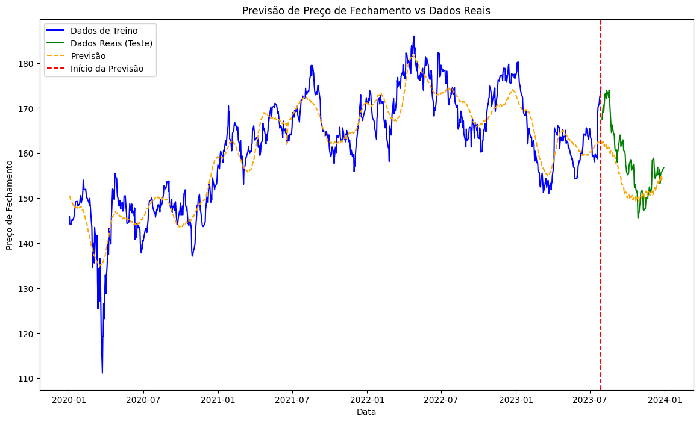

#  Análises de Séries temporais

## Manipulação de dados e criação de gráficos com Python
Acesso ao código: [Séries temporais](https://colab.research.google.com/drive/18wgFpCEMMtAPZe2Adc2jH-GOdIGfu8mW?usp=sharing)

## Ambiente de desenvolvimento
- Google Colab

## Importação do dataset
#### Utilizando a API: Yahoo Finance
    yf.download("JNJ", start="2020-01-01", end="2023-12-31", progress=False)

## Importação da bibliotecas
- Biblioteca Manipulação:
    - import pandas as pd

- Biblioteca Visualização:
    - import matplotlib.pyplot as plt

- Biblioteca para baixar dados financeiros
    - import yfinance as yf

- Biblioteca para previsão de séries temporais
    - from prophet import Prophet
    
## Criação de dataframe
- dados, 1006 rows × 7 columns
- nome colunas: "Open", "High", "Low", "Close",	"Adj Close", "Volume"

### Resetar index
    dados.reset_index()

## Modelagem
#### Criação de dados de treino e dados teste
    dados_treino = dados[dados['Date'] < '2023-07-31']
    dados_teste = dados[dados['Date'] >= '2023-07-31']

#### Selecionando apenas as colunas "Date" e "Close"
    dados_prophet_treino = dados_treino[['Date', 'Close']]

#### Renomeando as colunas conforme pré-definido pelo modelo
    dados_prophet_treino = dados_prophet_treino.rename(columns={'Date': 'ds', 'Close': 'y'})

#### Criação do modelo
    modelo = Prophet(weekly_seasonality=True,
        yearly_seasonality=True,
        daily_seasonality=False)
    modelo.add_country_holidays(country_name='US')

#### Treinamento do modelo
    modelo.fit(dados_prophet_treino)

#### Criação de datas futuras 
    futuro = modelo.make_future_dataframe(periods=150)

#### Fazendo a predição
    previsao = modelo.predict(futuro)

## Visualização 
#### Matplotlib
    plt.figure(figsize=(14, 8))
    plt.plot(dados_treino['Date'], dados_treino['Close'], label='Dados de Treino', color='blue')
    plt.plot(dados_teste['Date'], dados_teste['Close'], label='Dados Reais (Teste)', color='green')
    plt.plot(previsao['ds'], previsao['yhat'], label='Previsão', color='orange', linestyle='--')

    plt.axvline(dados_treino['Date'].max(), color='red', linestyle='--', label='Início da Previsão')
    plt.xlabel('Data')
    plt.ylabel('Preço de Fechamento')
    plt.title('Previsão de Preço de Fechamento vs Dados Reais')
    plt.legend()
    plt.show()

 

 