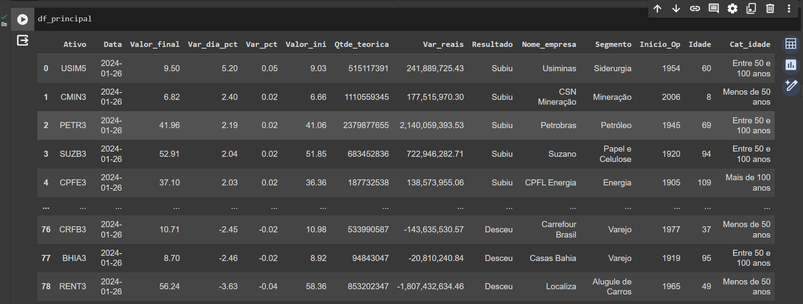

# Manipulação de dados e criação de gráficos com Python
Acesso ao código: [Manipulação de Dados com Python](https://colab.research.google.com/drive/1KPcOqpykvGZGvtTgzu_A9GMbKxfsE8xO?usp=sharing)

## Ambiente de desenvolvimento
- Google Colab

## Importação do dataset
- Nome dataset: ações.xlsx
    - folhas: "Principal"; "Chat_gpt"; "Total_de_acoes"; "Ticker"
- Utilizando o pacote google.colab e importando o módulo files para realizar upload de arquivos
para o ambiente do Colab durante a execução do notebook

## Importação da bibliotecas
- Biblioteca Pandas:
    - import pandas as pd

## Crição de dataframe
- df_principal, 82 rows × 11 columns
- df_chat_gpt, 78 rows × 4 columns
- df_total_acoes,  89 rows × 2 columns
- df_ticker, 535 rows × 2 columns

## Manipulação de dados:
### Alteração notação científica
- Alteração formatação de dados para todos os dataframes
    - pd.options.display.float_format = '{:,.2f}'.format

### Análise básica

#### Dataframe principal: *df_principal*
- Selecionar apenas as variáveis de interesse:
    - 'Ativo', 'Data', 'Último (R$)', 'Var. Dia (%)'
- Renomear os nomes das colunas, excluindo espaço e caracters especiais:
    - .rename(columns={'Último (R$)':'Valor_final', 'Var. Dia (%)':'Var_dia_pct'})
- Criar nova coluna de variação diária percentual em número decimais 'Var_pct':
    - ['Var_dia_pct']/100
- Criar nova coluna com valor inicial 'Valor_ini':
    - ['Valor_final']/(df_principal['Var_pct']+1)

- Mergiar df_principal e df_total_acoes:
    - .merge(df_total_acoes, left_on="Ativo", right_on="Código", how='left')
- *Ajustar df_principal após merge:*
    - Remover a coluna Código do df_principal:
        - .drop(columns=['Código'])
    - Renomear a coluna Qtde. Teórica:
        - .rename(columns={'Qtde. Teórica':'Qtde_teorica'})
    - Criar coluna de Variação em reais 'Var_reais':
        - (df_principal['Valor_final'] - df_principal['Valor_ini']) * df_principal['Qtde_teorica']
    -Alterar tipo de dados da coluna Qtde_teorica:
        - ['Qtde_teorica'].astype(int)
    - Criar coluna resultado:
        - ['Var_reais'].apply(lambda x: "Subiu" if x > 0 else ("Desceu" if x < 0 else "Estável"))

- Mergiar df_principal e df_ticker:
    - .merge(df_ticker, left_on='Ativo', right_on="Ticker", how='left')
- *Ajustar df_principal após merge:*
    - Remover coluna Ticker do df_principal:
        - .drop(columns='Ticker')
    - Renomear coluna Nome para Nome_empresa:
        .rename(columns={'Nome':'Nome_empresa'})

- Mergiar df_principal e df_chat_gpt:
    - .merge(df_chat_gpt, left_on="Nome_empresa", right_on="Nome da Empresa", how='left')
- *Ajustar df_principal após merge:*
    - Remover coluna Nome da Empresa do df_principal:
        - .drop(columns='Nome da Empresa')

- Criar coluna com faixas de idade:
    - Menos de 50 anos
    - Mais de 100 anos
    - Entre 50 e 100 anos
        - ['Idade'].apply(lambda x: "Menos de 50 anos" if x <= 50 else("Entre 50 e 100 anos" if (x > 50 and x < 100) else "Mais de 100 anos"))

#### Visualização dataframe após todas as manipulações
 
 
 

## Análise descritiva
- Utilizando as operações estatísticas básicas em conjuntos de dados numéricos, como métodos .max(), .min() e .mean(), aplicando também filtro simples para agrupar as categorias.
    - Maior variação
    - Menor variação
    - Média de variação
    - Média de variação que subiram
        - df_principal[df_principal['Resultado'] == "Subiu"]['Var_reais'].mean()
    - Média de variação que desceram
        - df_principal[df_principal['Resultado'] == "Desceu"]['Var_reais'].mean()
    
    - Qual a maior e menor variação no dia?
        - maior_query = df_principal[df_principal['Var_reais'] == df_principal['Var_reais'].max()]
        - menor_query = df_principal[df_principal['Var_reais'] == df_principal['Var_reais'].min()]
        - df_resultado_final = pd.concat([maior_query, menor_query], axis=0)
        - df_resultado_final.reset_index(drop=True, inplace=True)

## Análise qualitativa
- Utilizando a função groupby() para agrupar os dados do df_princiapl nos valores das colunas juntamento com a funções de agg(), size() e sum(), para possibiliatar responder as perguntas de negócio.
    - Quais são os agentes que se destacaram em relação a variação que subiu?
        - df_principal_subiu = df_principal[df_principal['Resultado'] == "Subiu"]
        - df_principal_subiu = df_principal_subiu.groupby('Segmento')['Var_reais'].sum().reset_index().sort_values('Var_reais', ascending=False)
    
    - Quais são os agentes que se destacaram em relação a variação que desceu?
        - df_principal_desceu = df_principal[df_principal['Resultado'] == "Desceu"]
        - df_principal_desceu = df_principal_desceu.groupby('Segmento')['Var_reais'].sum().reset_index().sort_values('Var_reais')

    - Quais foram as variações totais por segmeto?
        - df_analise_segmento = df_principal.groupby('Segmento')['Var_reais'].sum().reset_index()

    - Qual o balanço do dia em relação aos agentes que tiveram suas variações que subiram e que desceram?
        - df_analise_saldo = df_principal.groupby('Resultado')['Var_reais'].sum().reset_index()
    
    - Qual o impacto da idade da empresa, e qual a faixa representa maior sensibilidade?
        - df_faixa_idade = df_principal.groupby('Cat_idade').agg({'Var_reais':'sum', 'Cat_idade':'size'}).rename(columns={'Cat_idade': 'Qtde_Empresas'}).reset_index().sort_values('Qtde_Empresas', ascending=False)

## Visualização
- Utilizando a biblioteca Plotly.express para plotar os gráficos das análises descritivas e qualitativas:
 
Fig1 = Gráfico de colunas:
 
 
 
Fig2 = Gráfico de colunas:
 
 
 
Fig3 = Gráfico de rosca hierárquico:
 
 
 
Fig4 = Gráfico de barras:
 
 
 
Fig5 = Gráfico de barras:
 
 
 
Fig6 = Gráfico de barras:
 
 
 
Fig7 = Gráfico de colunas:
 

 